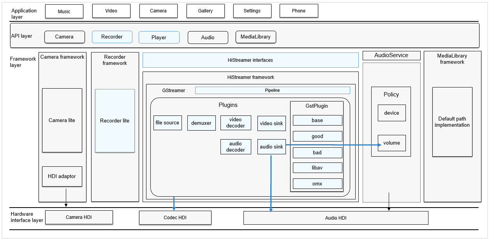

# Media<a name="EN-US_TOPIC_0000001147574647"></a>

-   [Introduction](#section1158716411637)
-   [Directory Structure](#section161941989596)
-   [Repositories Involved](#section1533973044317)

## Introduction<a name="section1158716411637"></a>

The  **media\_standard**  repository provides a set of simple and easy-to-use APIs for you to access the system and media resources.

It offers various media services covering audio, videos, and media storage. The following media capabilities are provided:

-   Audio playback and recording
-   Video playback and recording

**Figure  1**  Position in the subsystem architecture<a name="fig99659301300"></a>  




## Directory Structure<a name="section161941989596"></a>

The structure of the repository directory is as follows:

```
/foundation/multimedia/media_standard
├── frameworks                           # Framework code
│   ├── include                          # Header files included in the framework
│   └── src                              # Framework implementation
├── interfaces                           # External APIs
│   └── kits                             # External API files
├── LICENSE                              # License file
 └── ohos.build                          # Build file
```

## Repositories Involved<a name="section1533973044317"></a>

multimedia\_media\_standard

