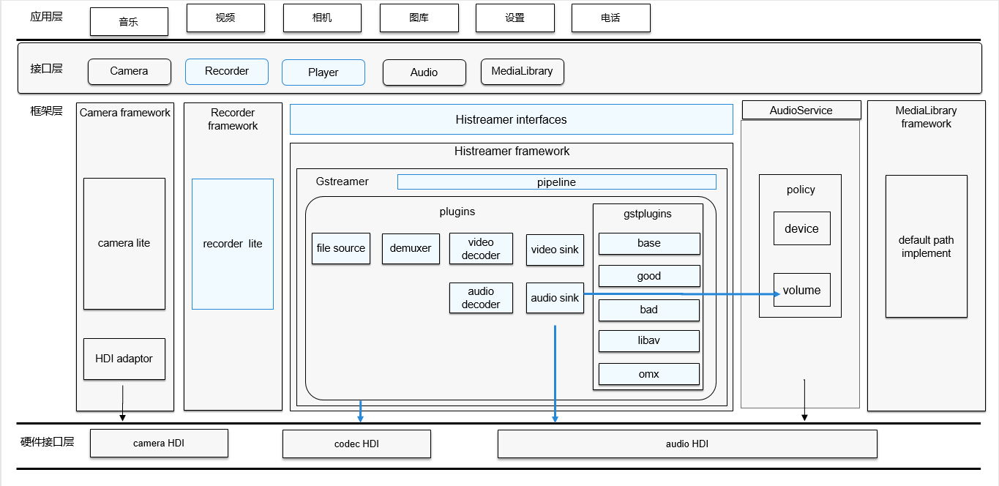

# 媒体组件<a name="ZH-CN_TOPIC_0000001147574647"></a>

-   [简介](#section1158716411637)
-   [目录](#section161941989596)
-   [相关仓](#section1533973044317)

## 简介<a name="section1158716411637"></a>

媒体组件为开发者提供一套简单易于理解的接口，能够使得开发者方便接入系统并使用系统的媒体资源。

媒体组件包含了音视频、媒体存储等相关媒体业务，提供以下常用功能：

-   音频播放和录制。
-   视频播放和录制。

**图 1**  媒体组件架构图<a name="fig99659301300"></a>  




## 目录<a name="section161941989596"></a>

仓目录结构如下：

```
/foundation/multimedia/media_standard    # 媒体组件业务代码
├── frameworks                           # 框架代码
│   ├── innerkitsimpl                    # native框架实现
│   ├── kitsimpl                         # js框架实现
│   ├── videodisplaymanager              # 显示实现
├── interfaces                           # 外部接口层
│   ├── innerkits                        # native外部接口文件
│   └── kits                             # js外部接口文件
├── services                             # 服务实现
│   ├── include                          # 服务对外头文件
│   ├── services                         # 服务框架
│   │   ├── player                       # 播放C/S框架
│   │   ├── recorder                     # 录制C/S框架
│   │   ├── avcodec                      # 编解码C/S框架
│   │   ├── avcodeclist                  # 编解码器能力查询C/S框架
│   │   ├── avmetadatahelper             # 元信息缩略图C/S框架
│   │   ├── media_data_source            # datasource C/S框架
│   │   ├── sa_media                     # 媒体主进程 C/S框架
│   │   ├── factory                      # 引擎工厂
│   │   ├── engine_intf                  # 引擎API
│   ├── engine                           # 引擎实现
│   │   ├── gstreamer                    # gstreamer引擎
│   │   │   ├── player                   # 播放引擎
│   │   │   ├── recorder                 # 录制引擎
│   │   │   ├── avcodec                  # 编解码引擎
│   │   │   ├── avcodeclist              # 编解码器能力查询
│   │   │   ├── avmetadatahelper         # 元信息缩略图引擎
│   │   │   ├── plugins                  # 引擎自研插件
│   │   │   ├── common                   # 引擎通用资源
│   │   │   ├── factory                  # 引擎工厂实现
│   │   │   ├── loader                   # 引擎资源加载
│   ├── utils                            # 子系统基础资源
├── LICENSE                              # 证书文件
└── ohos.build                           # 编译文件
```

## 相关仓<a name="section1533973044317"></a>

媒体组件仓：multimedia\media_standard

